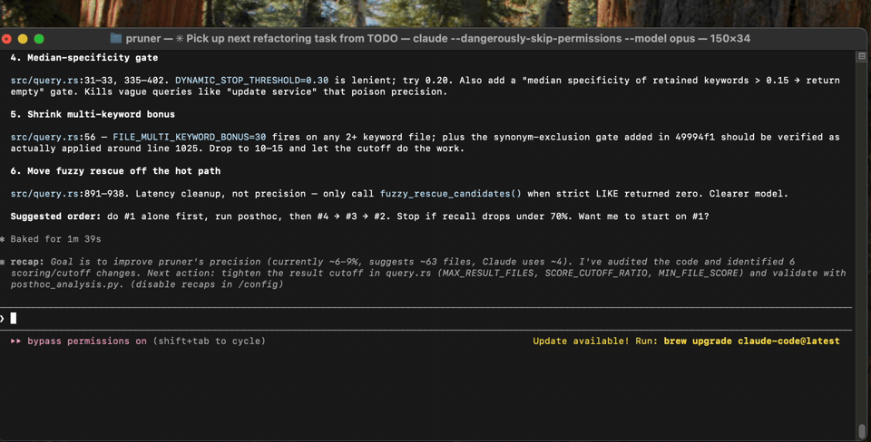

<p align="center">
  
</p>

<h1 align="center">Stick Around</h1>

<p align="center">
  <strong>A tiny RPG that lives on top of your terminal.</strong>
</p>

<p align="center">
  <a href="https://github.com/heikki-laitala/stick-around/actions/workflows/ci.yml"></a>
  <a href="./LICENSE"></a>
  
</p>

<p align="center">
  
</p>

Your next Claude Code task is going to take ninety seconds. You could
watch the spinner. Or — hear us out — you could take control of a
wizard-hat stick hero, swing a grappling rope off a `npm install` line,
mine a glowing mana crystal out of the ceiling, zap lightning at a
falling meteor, and earn titles on the way.

Stick Around is an overlay RPG for iTerm2, Terminal.app, Windows
Terminal, and GNOME terminals (Ptyxis, GNOME Terminal). Your terrain
is your terminal: every line of output is solid ground you can run,
jump, and rope-swing across. When Claude streams new output, the
world rearranges itself underneath you. You adapt — cast a shield,
mine a crystal, push on to the next mission — or you fall into the
void and respawn at the start.

## Features

- **Platforms made from your terminal.** Every log line is a platform.
  Run across diffs. Stand on prompts. Surf a streaming build log.
- **Rope, spells, and an axe.** Swing a grappling rope off ceilings.
  Mine mana crystals. Hold lightning to aim, release to fire. Raise a
  shield when the world turns hostile.
- **Five missions.** Collect glowing balls → mine crystals → escape
  rising lava → survive a meteor shower → fight through a pitch-black
  level with only a flashlight.
- **Give up whenever.** `Esc` hands focus back to the terminal and the
  stick man carries on without you. `Shift+click` to take over again.
- **Zero impact on Claude.** The game runs in its own process. You are
  not slowing the spinner down. You are just refusing to be bored by it.

## Requirements

**macOS** (Apple Silicon, arm64):

- **iTerm2 or Terminal.app** as the host terminal. Intel Macs aren't
  built yet.
- **Accessibility permission** — the first launch will prompt you to
  grant the binary access under *System Settings → Privacy & Security →
  Accessibility*. Without it the overlay can't read the terminal content
  and will exit.

**Windows** (Windows 10 / 11):

- The overlay reads terminal text via UI Automation's `TextPattern`.
  Tested with **PowerShell** — that's the shell that's been put through
  real use. Any host that exposes `TextPattern` (Windows Terminal,
  modern conhost / console, VS Code's integrated terminal) should work,
  but combinations beyond PowerShell are unverified. Legacy hosts
  without UIA text support aren't supported.
- No special permission grant is required.

**Linux** (GNOME / Wayland):

- **GNOME Shell** (Wayland session) on Mutter 45+. Tested on Ubuntu 25.10
  with Ptyxis. Other VTE-based terminals (GNOME Terminal, kgx) and any
  terminal that exposes a `role=terminal` AT-SPI accessible should work,
  but only Ptyxis has been put through real use. Non-GNOME compositors
  aren't supported — Wayland's security model means the overlay needs
  the GNOME Shell helper extension to track terminal windows, register
  the activation shortcut, and bypass `XGrabKey`.
- **GNOME helper extension** must be installed and enabled. Build from
  source and run `make install-extension` (Wayland reload requires
  log out / log back in), then `gnome-extensions enable
  stick-around@stickaround.dev`.
- **Dock icon** — run `make install-desktop` once to drop a
  `stick-around.desktop` plus a 512 px icon under `~/.local/share` so
  the dock matches the running window's `wm_class` to the bundled art
  instead of a generic placeholder.
- No accessibility permission prompt — Linux uses AT-SPI, which is
  available without a per-app grant on most distros (Ubuntu defaults
  `org.gnome.desktop.interface.toolkit-accessibility` to `false` but
  GTK4 apps like Ptyxis still expose their text widget).

## Install

With Claude Code:

```
/plugin marketplace add heikki-laitala/stick-around
/plugin install stick-around@stick-around
```

Then from inside Claude Code:

```
/stick-around:play
```

### What happens on first launch

`/plugin install` only mirrors the source tree, so the binary itself
needs to be fetched separately. A `SessionStart` hook bundled with the
plugin (`scripts/bootstrap.sh` on macOS / Linux, `scripts/bootstrap.ps1`
on Windows) handles that automatically:

- Reads the version from `.claude-plugin/plugin.json`.
- Downloads the matching prebuilt binary from the GitHub release
  (`stick-around-{linux-x86_64,macos-arm64,windows-x86_64}.{tar.gz,zip}`)
  and verifies the sha256 sidecar.
- On Linux additionally installs the GNOME Shell helper extension,
  the `.desktop` entry, and a 512px dock icon.

The hook runs on every Claude Code session start but is idempotent
and short-circuits when everything is up to date — first session
after install / update is the only slow one. No Node or other
runtime is required: the POSIX script uses `sh` + `curl` + `tar` +
`sha256sum`/`shasum`, and the Windows one uses PowerShell built-ins
(`Invoke-WebRequest`, `Get-FileHash`, `tar.exe`).

### Per-platform follow-ups

- **macOS**: the first run prompts for Accessibility permission
  (*System Settings → Privacy & Security → Accessibility*). Grant it
  and re-run `/stick-around:play`.
- **Linux (GNOME / Wayland)**: log out and log back in once after the
  first install — Mutter only loads helper extensions on shell start,
  so the activation keybinding (`Super+Shift+G`) doesn't work until
  the session restarts.
- **Windows**: nothing additional.

### Upgrading

Run `/plugin update stick-around@stick-around` from inside Claude
Code. The next session start triggers the hook, which detects the
new version, downloads the matching release artifact, and refreshes
any platform-specific files. On Linux that means a freshly
re-templated `.desktop` (so the dock points at the new cache path)
and, if the helper extension code changed, another log-out / log-in
to load the new version.

## Taking and releasing focus

The overlay floats above the terminal and only grabs your keyboard when
it has focus. You toggle between the two:

- **Shift + click** anywhere on the overlay — grabs focus so keys go to
  the game. *macOS / Windows only* — Wayland blocks global click
  monitoring from clients, so on Linux click-to-focus works only when
  you click directly on the HUD strip.
- **Cmd/Win/Super + Shift + G** — same thing, without the mouse. (Cmd
  on macOS, Windows key on Windows, Super on Linux. The Linux binding
  is owned by the GNOME helper extension via Mutter, so it works on
  Wayland where the macOS/Windows `XGrabKey` path is rejected.)
- **Esc** — releases focus back to the terminal so you can keep typing.
  The stick man carries on; he just stops listening to your keys until
  you grab focus again.

## Quitting

- Click the **✕** button in the top-right of the HUD, or
- Press **Shift + Q** while the overlay has focus.

## Movement

| Key       | Action                       |
| --------- | ---------------------------- |
| `A` / `D` | Walk left / right            |
| `W`       | Jump                         |
| `C`       | Toggle prone (lie flat)      |

Arrow keys are reserved for **aiming** — they don't walk the stick
man. Use `A` / `D` for that.

## Rope

The rope is your main way across gaps and up to higher platforms.

1. **Aim** — press `E`. A dotted aim line appears; sweep it with
   `←` / `→` to pick an angle.
2. **Fire** — release `E`. The rope flies out. If it sticks to a ceiling
   or ledge you start swinging from it.
3. **While swinging**:
   - `A` / `D` pump the swing left or right.
   - `W` climbs up the rope, `S` lowers you down.
   - Press `E` again to let go — you keep the swing's velocity, so
     timing the release is how you launch across long gaps.

## Spells

Each spell has its own slot key. The slot keys also set which spell
the spare cast key (`R`) fires, so a pinch fight can stay on the
home row.

- **`1` Shield** — tap to raise the dome, tap again to drop it. Blocks
  damage while up but drains mana continuously.
- **`2` Lightning** — *hold* `2` to aim (sweep with `←` / `→`), *release*
  `2` to fire. Costs 2 mana per bolt.
- **`R`** — cast the spell currently shown in the HUD. Same effect as
  pressing the slot key for that spell, just under your index finger.

Mana doesn't regenerate on its own — mine mana crystals with `F` to refill.

## Tools and HUD

| Key           | Action                                                      |
| ------------- | ----------------------------------------------------------- |
| `F`           | Swing axe — breaks crystals and thin ceilings               |
| `Tab`         | Cycle inventory slot                                        |
| `G`           | Recharge flashlight (alone-in-dark mission, costs one ball) |
| `Shift + R`   | Restart the current mission                                 |

## Missions

The game runs a short progression. The first two missions always come
in the same order — a warm-up. After that, the remaining missions are
shuffled per session, so each run plays the variable tail in a fresh
sequence (no repeats within a run).

1. **Collect 5 glowing balls** — warm-up run across the rooftops.
2. **Collect 4 mana crystals** — use `F` to mine them.

After the warm-up, in random order:

- **Escape the lava** — keep moving up before the floor catches you.
- **Meteor shower** — dodge falling rocks; you spawn at a safe point
  when it starts.
- **Alone in the dark** — the world goes black and you carry a
  flashlight. Sweep its beam with the arrow keys, and press `G` to
  burn a collected ball into battery charge when the light fades.
- **Ice age** — every platform freezes (sliding-with-momentum), and
  giant icicles hang from the terminal ceiling. Mine snow chunks
  with `F` (they age out and respawn elsewhere), deliver three of
  them to the build zone above the prompt to grow a snowman base →
  torso → head. A shaking icicle telegraphs with a warm tint and a
  pulsing red shadow on the platform it's about to hit; getting
  crushed is instant fail unless your shield is up.
- **Evil twin** — a second stick figure shadows you, replaying your
  movements (and your rope swings) from a few seconds back. Goal:
  collect 5 glowing balls while it stalks you.
  - Touching the twin costs a life; three hits and the run ends.
    Shield blocks contact damage.
  - Every few seconds the twin charges a lightning bolt at you — a
    dashed red aim line draws from its head with imperfect tracking,
    so a sharp sidestep escapes the lane. Direct bolt hit ends the
    run unless the shield is up.
  - Your own lightning (cast from `1`/`2` or `R`) stuns the twin for
    ~2 s and interrupts any in-flight charge. The mission primes you
    with 7 mana and seeds walk-over **blue mana orbs** on the
    platforms (touch to refill, +2 mana each) so you can keep zapping.
  - Twin bolts leave brief red scorch marks on the platforms they
    crossed — read where the danger lanes have been.
  - The lag tightens from ~3 s down to ~1.5 s as you collect balls,
    forcing decisive endgame movement.
- **Shardfall** — magical shards rain from the top; catch six of
  them by walking under or jumping up to intercept. The mission
  grants access to a third spell slot, **stasis**: hold `3` (or `R`
  once selected) to scale shard physics down to 0.25× while it
  drains mana, long enough to read a trajectory and reposition.
  Falling shards punch slim holes through any platform top they
  cross, so the floor degrades as the mission goes on. Completing
  the mission unlocks the stasis spell.

`Shift + R` restarts just the current mission if you get stuck.

## Development

```bash
make dev                 # build the Tauri binary and install into the plugin cache
make test                # vitest
make lint                # eslint
make install-extension   # Linux: install GNOME helper, requires Wayland session restart
make install-desktop     # Linux: install .desktop entry + dock icon
```

The Rust backend lives in `src-tauri/`; the canvas game code is in `src/`.
`make dev` is the round-trip — it rebuilds the binary and copies it to the
plugin cache used by the `/stick-around:play` skill, so a relaunch picks up
the new build.

The Linux GNOME extension lives in `gnome-extension/`. It exposes window
tracking, geometry control, and the activation keybinding over D-Bus
because Wayland's security model blocks regular clients from doing those
things directly.

Version strings are stamped at build time from `build.rs` (`v<YYYY.MM.DD>`)
and exposed to the frontend via the `get_version` Tauri command.

## License

[MIT](./LICENSE) © Heikki Laitala
